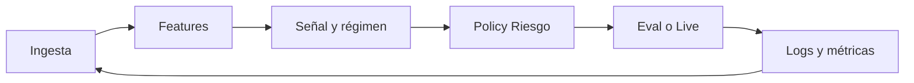

# Arquitectura del STE (sistema autónomo, largo plazo)

## 1. Principios (fijos)

- **Una sola verdad de datos:** series y órdenes con esquema versionado, reloj y huso explícitos.
- **Riesgo antes que señal:** toda ruta a ejecución pasa por *policy* (límites, halt, régimen, tamaño).
- **Evolución probada:** *research* y *eval* nunca se colapsan *inline* con *live*; mismas interfaces, distintos *drivers*.
- **Trazas completas:** cada decisión llevable a `run_id` + *inputs* + *versión de modelo* + resultado.
- **Nada de capital real** sin: sombra, criterio numérico y *kill switch* comprobable.

## 2. Planos lógicos (cómo engranan)

| Plano | Contenido típico | Contrae con |
|-------|------------------|------------|
| **Ingesta** | MT5, APIs, websockets, almacenamiento (Parquet/TSDB) | *Canonical bars/ticks* → |
| **Features** | Indicadores, *labels*, NLP, *embeddings* | *Feature matrix* + ventana de tiempo |
| **Señal / régimen** | Modelos, HMM, Hurst, *ensemble* | *SignalBatch* (solo intención, no orden) |
| **Riesgo y política** | Límites, DD, *regime gating*, tamaño, hedging lógico | *OrderIntent* o *Flat* |
| **Evaluación** | Backtest, *walk-forward*, *stress*, métricas | Sólo difiere el *executor* (simulado) |
| **Orquestación** | Jobs, cola, reintentos, *health*, API (p. ej. FastAPI) | Todos los planos, logs, alertas |
| **Ejecución (live)** | *BrokerAdapter*, confirmaciones, *slippage* reales | Misma interfaz que simulación |

*Agentes* (en Cursor o externos) no son un plano extra: **envuelven** comandos y revisiones que producen *diffs* o *artefactos* contra este mismo esquema.

## 3. Flujo (referencia)

*Live* inserta *RiskState* duro e *idempotencia* de órdenes entre *Policy* y *Execution*.

## 4. Contrato entre capas

Implementación inicial: módulo `ste.contracts` (types compartidos). Cualquier capa nueva importa de ahí, no *dicts* sueltos en la frontera.

- **Time:** UTC internamente; conversión a sesión al borde (UI, MT5 local).
- **Bares:** `open_time`, `timeframe`, `ohlc` + *instrument id*.
- **Señal:** direcciones discretas + confianza/opcional + *valid_until*.

## 5. Fases (criterio de “siguiente paso”)

| Fase | Hasta | Salida mínima |
|------|--------|----------------|
| **0 — Núcleo** | Ahora: señal simple, Hurst, riesgo, tests | *Green* en CI, sin broker |
| **1 — Esquema e ingestión** | *Bars* a disco, un pipeline reproducible | Un script: de origen a Parquet fijado en hash |
| **2 — Eval** | Motor *walk-forward* o *VectorBT*; costes; *sombra* | *Sharpe*/*DD* bajo reglas, sin fuga de futuro |
| **3 — Orquestación** | API, *scheduler*, *config* en env | *Paper* 24/7, mismas rutas que live |
| **4 — Live mínimo** | *Adapter* a MT5, tamaño micro | **Halt** probado, límites, sin “auto-rewrite” ciego de estrategia |

Cada fase se cierra con **criterio numérico y operativo**, no con “más features”.

## 6. Ritual diario (1 h útil, todos los días)

1. **Fijar una mejora atómica** (una *issue* o una *hypothesis*).
2. **PR pequeña** o commit con tests; regresión no alcanzada = no merge.
3. **Un número** en *dashboard* o *log* (R² de régimen, coste de *slip*, tasa de halt).
4. Revisar **límites** y **datos faltantes**; no tocar riesgo sin *review* consciente.

## 7. Tecnología (límites de ambición sana)

- *Stack* Python numérico compartido (NumPy/ Polars, etc.): **una* familia** en *ingest/features*; no duplicar *frames* incompatibles sin dolor.
- RAG / *agents*: **capa de ayuda a la evolución**, nunca reemplazo del *backtest* ni del *kill switch* humano+automático.
- Cython / latencia: solo donde el **perfil** lo pida, medido, no *premature*.

## 8. Dónde vive qué (repo)

- `src/ste/contracts` — esquemas de frontera
- `src/ste/ingest` — *Bar* → Parquet → *Bar* (reproducible) + utilidades sintéticas
- `src/ste/signal`, `regime`, `risk` — núcleo
- `src/ste/eval` — *walk-forward*; *backtest* y métricas (a expandir)
- `src/ste/execution` — *paper* y *driver* MT5 *lazy*
- `src/ste/orchestration` — API mínima (Fase 3+)
- `src/ste/intelligence` — *RAG* *stub* (vector DB real más adelante)
- `src/ste/config`, `src/ste/pipeline` — ajustes y fases
- `src/ste/integration` — cableado *signal → riesgo → paper*
- *Futuro* `execution/broker` real completo, *orchestra* *celery* en *prod*

Este documento se **actualiza** al cerrar fases, no a cada *commit* trivial.
